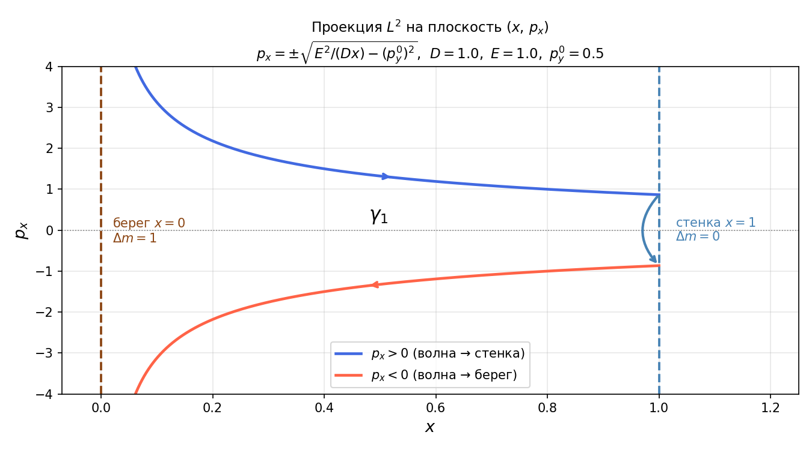
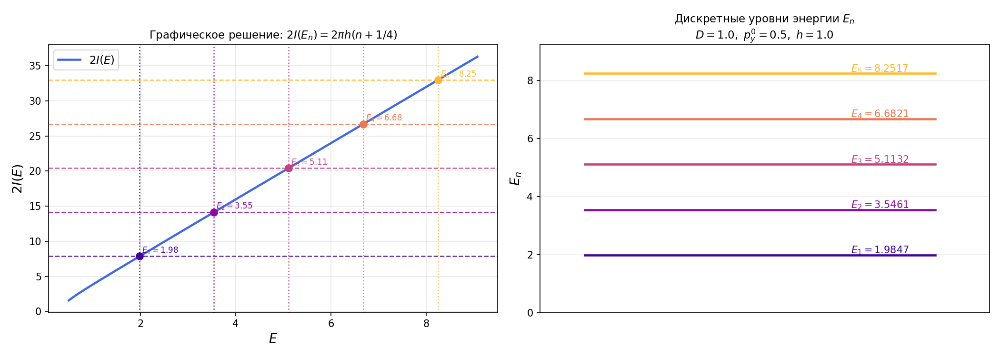
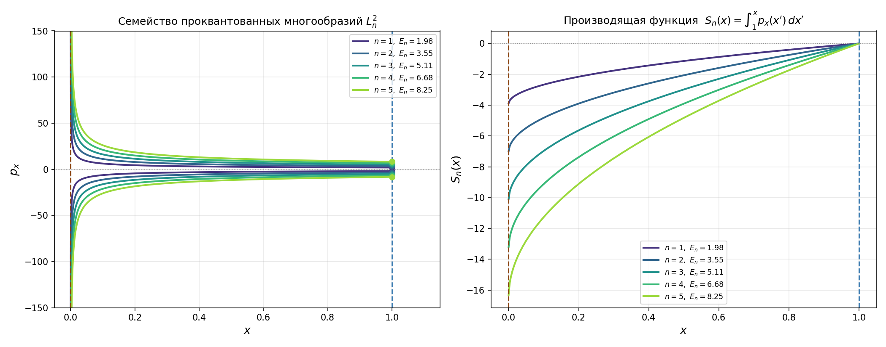
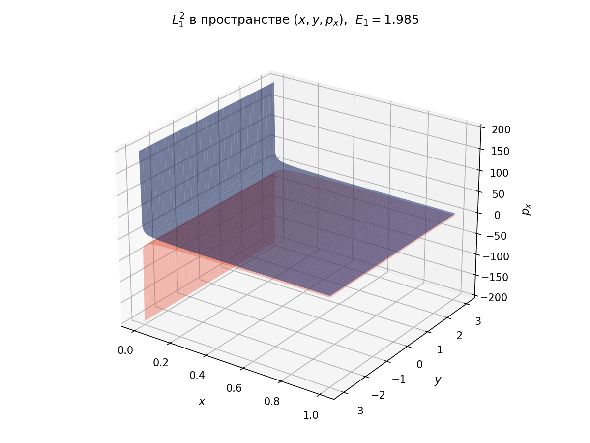
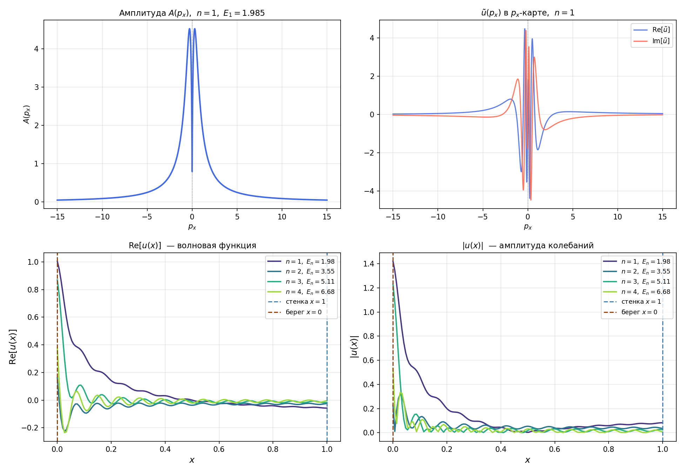

# Построение лагранжева многообразия и канонического оператора Маслова для мелководных волн

**Курс:** Математические задачи теории наноструктур (Асимптотические методы)  
**Параметры задачи:** $D = 1$, $p_y^0 = 0.5$, $h = 1$, уровни $n = 1, \ldots, 5$

---

## 1. Постановка задачи

Рассматриваются волны на мелкой воде с переменной глубиной. Гамильтониан системы:

$$H(x, y, p_x, p_y) = c(x)\sqrt{p_x^2 + p_y^2}, \qquad c^2(x) = Dx, \quad D > 0$$

Здесь $c(x) = \sqrt{Dx}$ — скорость распространения волны (глубина дна растёт линейно). Физическая область: $x \in [0, 1]$, $y \in \mathbb{R}$.

Граничные условия для волновой функции $u(x, y)$:

| Граница | Условие | Физический смысл | $\Delta\mu$ |
|---|---|---|---|
| $x = 0$ | $\|u\| < \infty$ | берег, регулярность решения | $1$ |
| $x = 1$ | $\partial_x u = 0$ | жёсткая стенка (условие Неймана) | $0$ |

**Цель работы:** построить лагранжево многообразие $\Lambda^2$, применить условие квантования Бора–Зоммерфельда–Маслова для нахождения дискретных уровней энергии $E_n$, вычислить канонический оператор Маслова $\hat{K}^h_{\Lambda^2_n}[1]$.

---

## 2. Лагранжево многообразие $\Lambda^2$

### 2.1 Построение

Фиксируем уровень энергии $E > 0$ и $p_y = p_y^0 = \mathrm{const}$. Лагранжево многообразие задаётся двумя условиями в фазовом пространстве $\mathbb{R}^4$:

$$\Lambda^2 = \{H = E\} \cap \{p_y = p_y^0\} \subset T^*\mathbb{R}^2$$

Оно является лагранжевым: $\dim \Lambda^2 = 2$ и симплектическая форма $\omega = dp_x \wedge dx + dp_y \wedge dy$ обращается в нуль на $\Lambda^2$.

### 2.2 Явная формула

Подставляем $p_y = p_y^0$ в условие $H = E$:

$$\sqrt{Dx}\,\sqrt{p_x^2 + (p_y^0)^2} = E \implies p_x^2 = \frac{E^2}{Dx} - (p_y^0)^2$$

$$\boxed{p_x(x) = \pm\sqrt{\frac{E^2}{Dx} - (p_y^0)^2}, \qquad x \in (0,\, 1]}$$

### 2.3 Геометрия и точка поворота

Выражение под корнем неотрицательно при $x \leq x_0$, где

$$x_0 = \frac{E^2}{D\,(p_y^0)^2}$$

— точка поворота (каустика, «вершина параболы»). Мы рассматриваем только левую часть многообразия и требуем $x_0 > 1$ (вершина правее стенки).

Поведение на границах:
- $x \to 0$: $|p_x| \to +\infty$ (берег, сингулярность скорости)
- $x = 1$: $p_x = \pm\sqrt{E^2/D - (p_y^0)^2}$ (конечное значение)

### 2.4 Путь $\gamma_1$ и индекс Маслова

Путь $\gamma_1$ на $\Lambda^2$:

$$\underbrace{(p_x > 0,\; x: 0 \to 1)}_{\text{верхняя ветвь}} \xrightarrow{\Delta\mu\,=\,0} \text{стенка} \xrightarrow{\text{прыжок}} \underbrace{(p_x < 0,\; x: 1 \to 0)}_{\text{нижняя ветвь}} \xrightarrow{\Delta\mu\,=\,1} \text{берег}$$

Полный индекс Маслова: $\mu = 1$.

*Рис. 1. Проекция лагранжева многообразия $\Lambda^2$ на плоскость $(x, p_x)$. Стрелки — направление обхода $\gamma_1$. Коричневый пунктир — берег ($\Delta\mu = 1$), синий — стенка ($\Delta\mu = 0$).*

---

## 3. Условие квантования. Уровни $E_n$

### 3.1 Формула квантования

Условие Бора–Зоммерфельда–Маслова с $\mu = 1$:

$$\oint_{\gamma_1} p_x\, dx - \frac{\pi h}{2} \cdot \mu = 2\pi h\, n \implies
\boxed{I(E_n) = \pi h\!\left(n + \frac{1}{4}\right)}, \quad n = 1, 2, 3, \ldots$$

где $\displaystyle I(E) = \int_0^1 \sqrt{\frac{E^2}{Dx} - (p_y^0)^2}\; dx$.

### 3.2 Аналитическое вычисление $I(E)$

Выполняем замену $t = \sqrt{x}$, т.е. $x = t^2$, $dx = 2t\, dt$:

$$I(E) = 2\int_0^1 \sqrt{A^2 - B^2 t^2}\; dt, \qquad A = \frac{E}{\sqrt{D}},\quad B = p_y^0$$

Вычисляем стандартный интеграл заменой $t = \frac{A}{B}\sin\varphi$:

$$\int_0^1 \sqrt{A^2 - B^2 t^2}\; dt = \frac{A^2}{2B}\arcsin\frac{B}{A} + \frac{1}{2}\sqrt{A^2 - B^2}$$

Итого:

$$\boxed{I(E) = \frac{E^2}{D\,p_y^0}\arcsin\!\frac{p_y^0\sqrt{D}}{E} + \sqrt{\frac{E^2}{D} - (p_y^0)^2}}$$

Аналитическое выражение совпадает с прямым численным интегрированием до 8 значащих цифр.

### 3.3 Уровни энергии

Уравнение $I(E_n) = \pi h(n + 1/4)$ трансцендентное, решается численно методом Брента.

| $n$ | $E_n$ | $x_0 = E_n^2 / (D \cdot (p_y^0)^2)$ |
|-----|--------|--------------------------------------|
| 1 | 1.984694 | 15.76 |
| 2 | 3.546077 | 50.30 |
| 3 | 5.113249 | 104.58 |
| 4 | 6.682125 | 178.60 |
| 5 | 8.251733 | 272.36 |

Все точки поворота $x_0 \gg 1$ — условие $x_0 > 1$ выполнено для всех уровней.

*Рис. 2. Слева: кривая $2I(E)$ и линии $2\pi h(n+1/4)$; точки пересечения — уровни $E_n$. Справа: дискретный спектр $\{E_n\}$.*

---

## 4. Проквантованное многообразие $\Lambda^2_n$

### 4.1 Определение

$$\boxed{\Lambda^2_n = \left\{p_x = \pm\sqrt{\frac{E_n^2}{Dx} - (p_y^0)^2},\quad p_y = p_y^0,\quad x \in (0,1],\quad y \in \mathbb{R}\right\}}$$

Это то же многообразие с дискретными значениями $E_n$ вместо непрерывного $E$.

### 4.2 Производящая функция $S_n(x)$

Действие вдоль $\Lambda^2_n$ от стенки до точки $x$:

$$S_n(x) = \int_1^x \sqrt{\frac{E_n^2}{Dx'} - (p_y^0)^2}\; dx'$$

При $x < 1$: $S_n(x) < 0$. При $x \to 0$: $|S_n| \to \infty$. Функция $S_n$ входит в фазу канонического оператора.

*Рис. 3. Слева: семейство $\Lambda^2_n$, $n = 1, \ldots, 5$. Справа: производящая функция $S_n(x)$ для каждого уровня.*

*Рис. 4. Многообразие $\Lambda^2_1$ в пространстве $(x, y, p_x)$. Синяя поверхность — $p_x > 0$, красная — $p_x < 0$.*

---

## 5. Канонический оператор Маслова

### 5.1 Переход к $p_x$-карте

На $\Lambda^2_n$ координата $x$ однозначно выражается через $p_x$:

$$x(p_x) = \frac{E_n^2}{D\bigl(p_x^2 + (p_y^0)^2\bigr)}, \qquad
\frac{dx}{dp_x} = -\frac{2E_n^2\, p_x}{D\bigl(p_x^2 + (p_y^0)^2\bigr)^2}$$

Производящая функция $G(p_x)$ определяется из $x = \partial G / \partial p_x$:

$$\boxed{G(p_x) = \frac{E_n^2}{D\, p_y^0}\arctan\frac{p_x}{p_y^0}}$$

### 5.2 Амплитуда

При постоянной амплитуде $a \equiv 1$ на многообразии якобиан замены $dx \to dp_x$ даёт:

$$\boxed{A(p_x) = \sqrt{\left|\frac{dx}{dp_x}\right|} = \sqrt{\frac{2E_n^2\, |p_x|}{D\bigl(p_x^2 + (p_y^0)^2\bigr)^2}}}$$

Асимптотика: $A \sim |p_x|^{1/2}$ при $p_x \to 0$; $A \sim |p_x|^{-3/2}$ при $|p_x| \to \infty$ (интеграл сходится).

### 5.3 Фаза Маслова

Фаза накапливается только при переходе через берег ($\Delta\mu = 1$):

$$\phi_M(p_x) = \begin{cases} 0 & p_x > 0 \quad \text{(верхняя ветвь, до берега)} \\ -\pi/2 & p_x < 0 \quad \text{(нижняя ветвь, после берега)} \end{cases}$$

### 5.4 Итоговые формулы

**Канонический оператор в $p_x$-карте:**

$$\boxed{\tilde{u}(p_x, y) = A(p_x) \cdot \exp\!\left(\frac{i}{h}\,G(p_x) + i\,\phi_M(p_x)\right) \cdot e^{\frac{i}{h}p_y^0\, y}}$$

**Волновая функция** (обратное преобразование Фурье $p_x \to x$):

$$\boxed{u(x, y) = \frac{e^{\frac{i}{h}p_y^0 y}}{\sqrt{2\pi h}} \int_{-\infty}^{+\infty} A(p_x)\, \exp\!\left(\frac{i}{h}\bigl[G(p_x) + x\, p_x\bigr] + i\,\phi_M(p_x)\right) dp_x}$$

Интеграл вычисляется численно методом трапеций на сетке $p_x \in [-80,\, 80]$, $N = 20\,000$ точек.

*Рис. 5. Верхний ряд: амплитуда $A(p_x)$ и функция $\tilde{u}(p_x)$ в $p_x$-карте для $n=1$ (скачок фазы при $p_x=0$ соответствует $\Delta\mu=1$). Нижний ряд: $\mathrm{Re}[u(x)]$ и $|u(x)|$ для $n=1,2,3,4$.*

---

## 6. Выводы

**1. Геометрия лагранжева многообразия.**
Для гамильтониана мелководных волн с линейной глубиной ($c^2 = Dx$) многообразие $\Lambda^2 = \{H=E,\, p_y=p_y^0\}$ имеет вид «параболы» в проекции на $(x, p_x)$. Точка поворота $x_0 = E^2/(D(p_y^0)^2)$ выведена за пределы физической области, что обеспечивает распространение волны по всей области $[0,1]$.

**2. Квантование.**
Условие БЗМ с полным индексом $\mu = 1$ (единственный скачок — на берегу) сводится к уравнению $I(E_n) = \pi h(n + 1/4)$. Интеграл $I(E)$ вычислен аналитически заменой $t = \sqrt{x}$, что позволяет точно находить $E_n$ для любого $n$.

**3. Волновые функции.**
Канонический оператор в $p_x$-карте с последующим обратным преобразованием Фурье даёт полуклассические собственные функции $u_n(x)$. Амплитуда нарастает при $x \to 0$ (эффект мелководья: волна усиливается по мере уменьшения глубины), число осцилляций на $[0,1]$ совпадает с квантовым числом $n$.

---

*Численные расчёты выполнены на Python 3 (numpy, scipy, matplotlib). Исходный код: `full_solution.py`.*